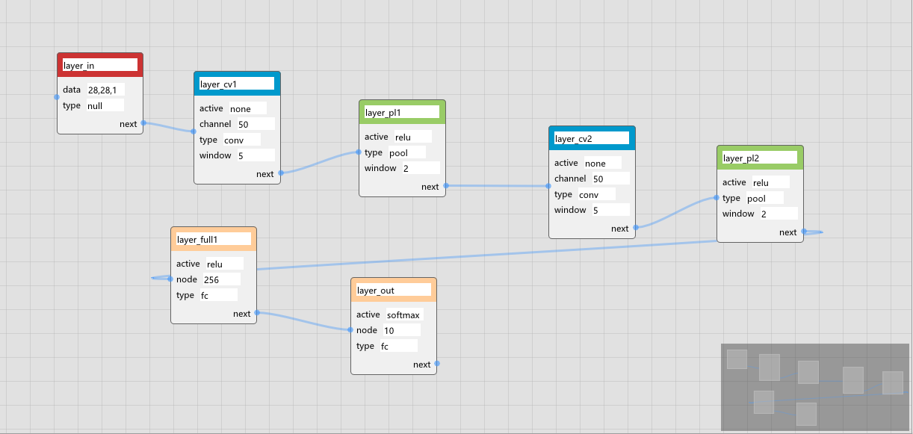
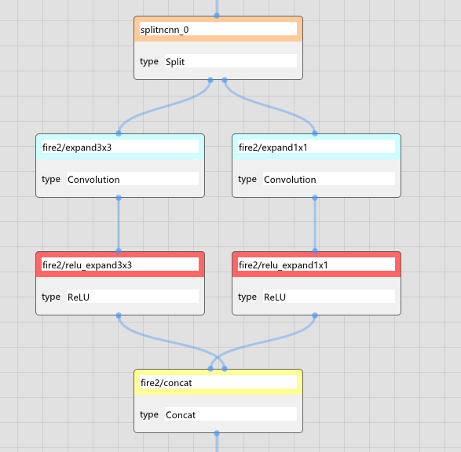
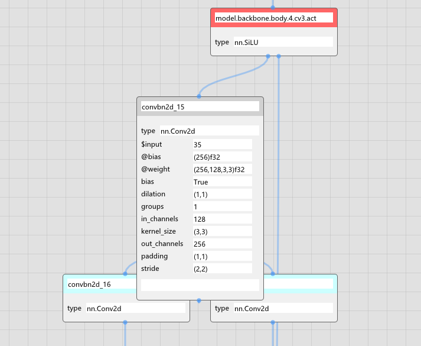

# ncnn-editor

<div align="right">


</div>

基于 [imnodes](https://github.com/Nelarius/imnodes) 的ncnn格式编辑工具。

QQ 群: 822911263

### 操作

* 按住中键，或者Alt+左键可以拖动整个图。
* 右键可以新建节点。
* 左键可以单选或框选节点和连接。
* 选中的节点可以拖动其位置（一些格式中，位置可能不会被保存）。
* Del删除选中的节点和连接，也可以使用右键选项删除。
* 选中一个节点时，节点会变大，此时可以编辑节点内容，目前的功能比较简单。
* 右键点某个节点可以建立连接点或清除空连接点。空连接点也可以不必清除，保存时会忽略。

### 支持的格式

配置文件来自<https://github.com/lutzroeder/netron>等。

* ini范例
* [ncnn](https://github.com/Tencent/ncnn/wiki/param-and-model-file-structure) 完全支持
* [pnnx](https://github.com/pnnx/pnnx) 该格式与ncnn基本一致，故可以直接支持，增加参数需手动
* yolo的简化格式（YAML）
* onnx目前只可以查看（这个支持太麻烦了，考虑去掉）


请大佬们pr支持新格式！

<div align="center">





</div>

## 授权

```bash
以 BSD 3-Clause License 授权发布。若将其商业应用，我们建议您提交一张书法照到官方 QQ 群。
```
