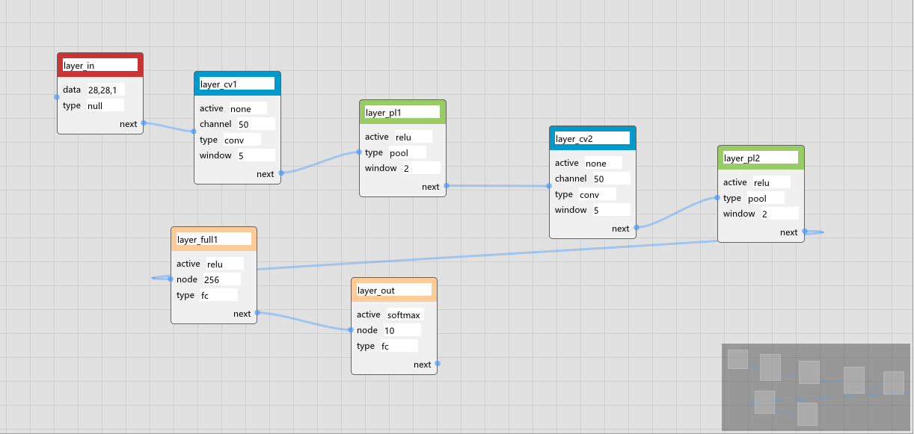
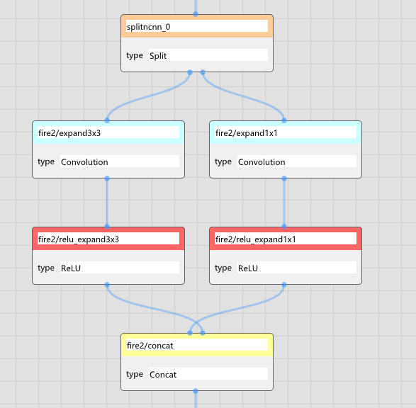
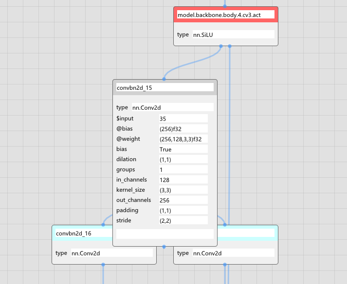

# ncnn-editor

<div align="right">


</div>

基于 [imnodes](https://github.com/Nelarius/imnodes) 的ncnn格式编辑工具。

### 操作

* 按住中键，或者Alt+左键可以拖动整个图。
* 右键可以新建节点。
* 左键可以单选或框选节点和连接。
* 选中的节点可以拖动其位置（一些格式中，位置可能不会被保存）。
* Del删除选中的节点和连接，也可以使用右键选项删除。
* 选中一个节点时，节点会变大，此时可以编辑节点内容，目前的功能比较简单。
* 右键点某个节点可以建立连接点或清除空连接点。空连接点也可以不必清除，保存时会忽略。

### 支持的格式

配置文件来自<https://github.com/lutzroeder/netron>等。

* ini范例
* [ncnn](https://github.com/Tencent/ncnn/wiki/param-and-model-file-structure) 完全支持
* [pnnx](https://github.com/pnnx/pnnx) 该格式与ncnn基本一致，故可以直接支持，增加参数需手动
* yolo的简化格式（YAML）
* 查看onnx（已删除此功能）

### 浏览器构建

GitHub Pages：<https://scarsty.github.io/ncnn-editor/>

项目现在可以通过 Emscripten 构建为浏览器版本，渲染后端仍然是 SDL3 + ImGui + WebGL2。

示例命令：

```bash
emcmake cmake -S . -B build-web -DNETEDIT_WEB=ON
cmake --build build-web
```

构建结果会生成 html 启动页。浏览器版本中：

* Open 会打开浏览器文件选择框，并把文件写入虚拟文件系统后加载。
* Save / Save as 会将当前编辑结果下载回浏览器。

仓库已提供自动发布工作流 [deploy-pages.yml](.github/workflows/deploy-pages.yml)，推送到 main 后会自动部署到 GitHub Pages。

<div align="center">





</div>

## 授权

```
以 BSD 3-Clause License 授权发布。若将其商业应用，我们建议您提交一张书法照到官方 QQ 群。
```
